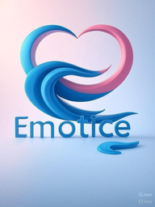

# 🌟 EMOTICE MVP - Your Emotional Wellness Companion

<div align="center">



**Track your mood • Chat with AI • Gain insights**

[](https://reactjs.org/)
[](https://www.typescriptlang.org/)
[](https://vitejs.dev/)
[](https://tailwindcss.com/)
[](https://supabase.com/)

[Live Demo](#) • [Documentation](#) • [Report Bug](#) • [Request Feature](#)

</div>

---

## 📖 About EMOTICE

EMOTICE is a modern emotional wellness platform that helps users track their daily moods, chat with an AI companion for emotional support, and gain valuable insights into their emotional patterns.

### ✨ Key Features

- 🎭 **Daily Mood Tracking** - Quick emoji-based mood logging
- 🤖 **AI Companion** - Empathetic chatbot for emotional support
- 📊 **Insights & Analytics** - Visualize your emotional patterns
- 🌍 **Multi-language** - 6 languages supported (EN, TR, ES, FR, RU, ZH)
- 🔐 **Privacy First** - Your data stays private and secure
- 📱 **Responsive Design** - Works on all devices

---

## 🚀 Quick Start

### Prerequisites

- Node.js 18+ 
- npm or yarn
- Supabase account (for backend)

### Installation

```bash
# Clone the repository
git clone https://github.com/nechh42/emotice-mvp.git

# Navigate to project directory
cd emotice-mvp

# Install dependencies
npm install

# Copy environment variables
cp .env.example .env

# Edit .env file with your credentials
nano .env
```

### Environment Variables

Create a `.env` file in the root directory:

```env
VITE_SUPABASE_URL=your_supabase_project_url
VITE_SUPABASE_ANON_KEY=your_supabase_anon_key
VITE_OPENAI_API_KEY=your_openai_api_key
VITE_APP_NAME=emotice-mvp
```

### Run Development Server

```bash
npm run dev
```

Open [http://localhost:5173](http://localhost:5173) in your browser.

### Build for Production

```bash
npm run build
```

The build will be available in the `dist/` directory.

---

## 🏗️ Tech Stack

| Category | Technology |
|----------|------------|
| **Frontend** | React 18, TypeScript, Vite |
| **Styling** | Tailwind CSS, Shadcn/ui |
| **State Management** | TanStack Query, Context API |
| **Routing** | React Router 6 |
| **Backend** | Supabase (Auth + Database) |
| **AI** | OpenAI API |
| **i18n** | i18next, react-i18next |
| **Forms** | React Hook Form + Zod |
| **Charts** | Recharts |

---

## 📂 Project Structure

```
emotice-mvp/
├── src/
│   ├── components/       # Reusable UI components
│   │   ├── ui/          # Shadcn/ui components
│   │   ├── chat/        # Chat-related components
│   │   └── onboarding/  # Onboarding flow
│   ├── pages/           # Route pages
│   │   ├── Index.tsx    # Landing page
│   │   ├── Dashboard.tsx # Main app dashboard
│   │   ├── Auth.tsx     # Authentication
│   │   └── legal/       # Legal pages
│   ├── contexts/        # React contexts
│   ├── lib/             # Utilities & configs
│   ├── services/        # API services
│   ├── hooks/           # Custom hooks
│   ├── data/            # Static data
│   └── types/           # TypeScript types
├── public/              # Static assets
├── dist/                # Production build
└── botpress/            # Chatbot (separate)
```

---

## 🎯 Features in Detail

### 1. Mood Tracking Dashboard

Track your emotions with 5 levels:
- 😭 Terrible
- 😢 Bad
- 😐 Okay
- 😊 Good
- 😄 Great

Add optional notes to your mood entries for deeper insights.

### 2. AI Companion Chat

Chat with an empathetic AI that:
- Listens to your feelings
- Provides emotional support
- Offers wellness suggestions
- Tracks conversation context

### 3. Emotional Insights

View your mood patterns:
- Day streaks
- Average mood
- Weekly trends
- Historical entries

### 4. Multi-language Support

Currently supported languages:
- 🇬🇧 English
- 🇹🇷 Türkçe
- 🇪🇸 Español
- 🇫🇷 Français
- 🇷🇺 Русский
- 🇨🇳 中文

### 5. Legal Compliance

- Medical Disclaimer
- Terms of Service
- Privacy Policy
- Cookie Policy
- Age Verification (16+)
- GDPR Compliant

---

## 💰 Pricing

### Free Plan
- ✅ Daily mood tracking
- ✅ 15 AI messages per day
- ✅ Basic insights

### Premium Plan - $7.99/month
- ✅ Unlimited mood tracking
- ✅ 100 AI messages per day
- ✅ Advanced analytics
- ✅ Export data

**Multi-month discounts:**
- 3 months: $20.99 (12% off)
- 6 months: $38.99 (18% off)

---

## 🔐 Database Schema

### Supabase Tables

#### `mood_entries`
```sql
CREATE TABLE mood_entries (
  id UUID DEFAULT gen_random_uuid() PRIMARY KEY,
  user_id UUID REFERENCES auth.users(id),
  mood_level INTEGER CHECK (mood_level >= 1 AND mood_level <= 5),
  intensity INTEGER CHECK (intensity >= 1 AND intensity <= 5),
  note TEXT,
  created_at TIMESTAMP WITH TIME ZONE DEFAULT NOW()
);

-- Enable RLS
ALTER TABLE mood_entries ENABLE ROW LEVEL SECURITY;

-- Policy: Users can only see their own entries
CREATE POLICY "Users can view own entries"
  ON mood_entries FOR SELECT
  USING (auth.uid() = user_id);

-- Policy: Users can insert their own entries
CREATE POLICY "Users can insert own entries"
  ON mood_entries FOR INSERT
  WITH CHECK (auth.uid() = user_id);
```

---

## 🧪 Testing

```bash
# Run tests (when implemented)
npm run test

# Run tests in watch mode
npm run test:watch

# Generate coverage report
npm run test:coverage
```

**Note:** Testing framework not yet implemented. TODO: Add Vitest + React Testing Library.

---

## 📦 Deployment

### Recommended: Vercel

```bash
# Install Vercel CLI
npm i -g vercel

# Deploy to production
vercel --prod
```

### Environment Variables in Vercel

Add these in your Vercel dashboard:
- `VITE_SUPABASE_URL`
- `VITE_SUPABASE_ANON_KEY`
- `VITE_OPENAI_API_KEY`

### Alternative Platforms

- **Netlify** - Simple drag & drop
- **Railway** - Backend-friendly
- **Cloudflare Pages** - Fast edge deployment

---

## 🤝 Contributing

Contributions are welcome! Please follow these steps:

1. Fork the repository
2. Create a feature branch (`git checkout -b feature/AmazingFeature`)
3. Commit your changes (`git commit -m 'Add some AmazingFeature'`)
4. Push to the branch (`git push origin feature/AmazingFeature`)
5. Open a Pull Request

### Development Guidelines

- Use TypeScript for all new code
- Follow the existing code style
- Add tests for new features
- Update documentation as needed
- Use conventional commits

---

## 🐛 Known Issues

1. ⚠️ OpenAI API integration not complete (demo mode active)
2. ⚠️ Botpress folder exists but not integrated
3. ⚠️ Payment system not implemented
4. ⚠️ Some translations incomplete (ES, FR, RU, ZH)
5. ⚠️ Analytics calculations are placeholder

See [Issues](https://github.com/nechh42/emotice-mvp/issues) for more.

---

## 🗺️ Roadmap

### Q1 2025
- [ ] Complete OpenAI API integration
- [ ] Add payment gateway (Stripe)
- [ ] Implement advanced analytics
- [ ] Complete all translations
- [ ] Add unit tests (70% coverage)

### Q2 2025
- [ ] Mobile app (React Native)
- [ ] Email notifications
- [ ] Export functionality
- [ ] Dark mode
- [ ] Social features (optional)

### Q3 2025
- [ ] Advanced AI features
- [ ] Partnership integrations
- [ ] Community features
- [ ] More languages

---

## 📄 License

This project is licensed under the MIT License - see the [LICENSE](LICENSE) file for details.

---

## 🙏 Acknowledgments

- [Shadcn/ui](https://ui.shadcn.com/) - Beautiful UI components
- [Supabase](https://supabase.com/) - Backend as a Service
- [OpenAI](https://openai.com/) - AI capabilities
- [Lucide](https://lucide.dev/) - Icon library
- [Tailwind CSS](https://tailwindcss.com/) - Styling framework

---

## 📧 Contact

For questions, suggestions, or support:

- **GitHub Issues:** [Report a bug](https://github.com/nechh42/emotice-mvp/issues)
- **Email:** support@emotice.com
- **Twitter:** [@emotice](https://twitter.com/emotice)
- **Discord:** [Join our community](#)

---

## ⚠️ Medical Disclaimer

**EMOTICE IS NOT A MEDICAL DEVICE OR SERVICE.**

This application is designed for emotional wellness tracking and support only. It is NOT a substitute for professional medical advice, diagnosis, or treatment.

If you are experiencing a mental health crisis:
- 🇺🇸 Call 988 (Suicide & Crisis Lifeline)
- 🇹🇷 Call 182 (Alo Destek Hattı)
- 🇪🇺 Call 112 (Emergency Services)

Always seek the advice of your physician or other qualified health provider with any questions you may have regarding a medical condition.

---

<div align="center">

Made with ❤️ by the EMOTICE Team

[Website](#) • [Docs](#) • [Blog](#) • [Status](#)

**Never Feel Alone with Your Emotions** 💜

</div>
